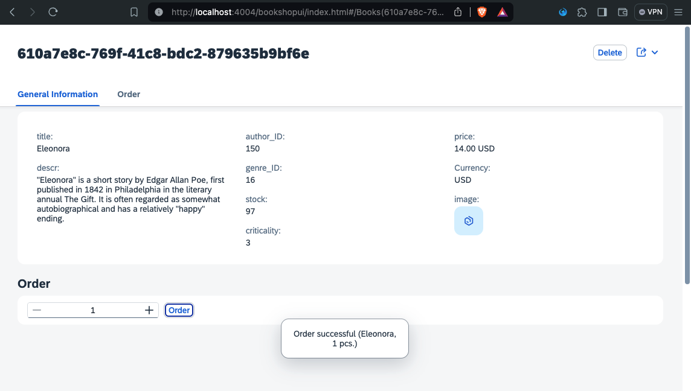

# Chapter 04 - Using the JavaScript handler 

By the end of this chapter, we will have implemented the order feature of the bookshop using the JavaScript handler of our custom section.

## Steps

- [1. Inspect the XML fragment](#1-inspect-the-xml-fragment)<br>
- [2. Add UI controls to the XML fragment](#2-add-ui-controls-to-the-xml-fragment)<br>
- [3. Implement the `.onSubmitOrder` method](#3-implement-the-onsubmitorder-method)<br>
- [4. Test the order feature](#4-test-the-order-feature)<br>
- [5. Further questions to discuss](#5-further-questions-to-discuss)<br>

## 1. Inspect the XML fragment

Before we implement the order feature, we want to make sure we really understand how the XML fragment currently works and how it loads its JavaScript handler.

➡️ Open the `app/bookshop-ui/webapp/ext/fragment/Order.fragment.xml` file and inspect its content.

The XML fragment consists of a simple vertical box (`<VBox />`) and a button (`<Button />`). The button requires the JavaScript handler directly (via `core:require`), which is an interesting difference compared to how XML views usually load their JavaScript counterparts - namely controllers. With XML views, controllers are usually linked via the `controllerName` attribute. XML fragment don't allow for this attribute, plus we don't even have a controller instance (yet). Inspect the `app/bookshop-ui/webapp/ext/fragment/Order.js` file to see that this simple module does not extend any controller. All it does is return a simple `onPress` method.

You can read more about requiring modules (not controllers) in the [official UI5 documentation](https://ui5.sap.com/#/topic/b11d853a8e784db6b2d210ef57b0f7d7).

## 2. Add UI controls to the XML fragment

Let's now add the neccesary UI controls for the order feature to the XML fragment.

➡️ Replace the content of the `app/bookshop-ui/webapp/ext/fragment/Order.fragment.xml` with the following code:

```xml
<core:FragmentDefinition xmlns:core="sap.ui.core" xmlns="sap.m" xmlns:macros="sap.fe.macros">

	<HBox
		id="hBox"
		core:require="{ handler: 'bookshopui/ext/fragment/Order'}" >

		<StepInput 
			id="stepInput"
			min="1"
			max="{stock}"
			textAlign="Center"
			validationMode="LiveChange" />

		<Button
			id="orderButton"
			text="Order"
			press="handler.onSubmitOrder"
			class="sapUiTinyMarginBegin" />

	</HBox>

</core:FragmentDefinition>
```

We added a new `<HBox />` as an outer wrapper and also moved the `core:require` statement for the handler to this wrapper. All elements inside this wrapper will have access to the handler. Inside, we added a `<StepInput />` to enable the user to enter their desired order quantity. We used the data binding syntax (more specifically [context binding](https://sapui5.hana.ondemand.com/sdk/#/topic/91f05e8b6f4d1014b6dd926db0e91070)) to set the `stock` of the selected book to be the max value of the input field. This is possible because the context of the selected book (its data) is bound to the XML fragment automatically - one of the gems of using the SAP Fiori elements flexible programming model. We also added a `<Button />` that executes the `.onSubmitOrder` method of our handler, which we will define in the next step.

## 3. Implement the `.onSubmitOrder` method

➡️ Replace the content of the `app/bookshop-ui/webapp/ext/fragment/Order.js` file with the following code:

```javascript
sap.ui.define([
    "sap/m/MessageToast",
    "sap/m/Dialog",
    "sap/m/Button",
    "sap/m/Text",
], function (MessageToast, Dialog, Button, Text) {

    return {
        onSubmitOrder: function (oEvent) {
            const oContext = oEvent.getSource().getBindingContext()
            const oModel = oContext.getModel()

            const selectedBookTitle = oContext.getProperty("title")
            const selectedBookID = oContext.getProperty("ID")
            const selectedQuantity = this.byId("stepInput").getValue()

            const oAction = oModel.bindContext("/submitOrder(...)")
            oAction.setParameter("book", selectedBookID)
            oAction.setParameter("quantity", selectedQuantity)

            oAction.execute().then(
                function () {
                    const sText = `Order successful (${selectedBookTitle}, ${selectedQuantity} pcs.)`
                    MessageToast.show(sText)
                    this.refresh()
                }.bind(this),
                function (oError) {
                    this.oErrorMessageDialog = new Dialog({
                        type: "Standard",
                        title: "Error",
                        state: "Error",
                        content: new Text({ text: oError.error.message })
                        .addStyleClass("sapUiTinyMargin"),
                        beginButton: new Button({
                            text: "Close",
                            press: function () {
                                this.oErrorMessageDialog.close()
                            }.bind(this)
                        })
                    })
                    this.oErrorMessageDialog.open()
                }.bind(this)
            )
        }
    }

})
```

We implemented the `.onSubmitOrder` method in our JavaScript handler. The method gets the bound context and data model from the element that was pressed and binds an OData action to that model. This `submitOrder` action was implemented as part of the OData backend service using SAP CAP - see [here](/bookshop/srv/cat-service.js).
After the action has been executed, the method either displays a success `MessageToast` and refreshs the data model, or it displays a `Dialog` with the error message.
).

You can read more about OData operations (including action bindings) in the [offical UI5 documentation](https://sapui5.hana.ondemand.com/sdk/#/topic/b54f7895b7594c61a83fa7257fa9d13f).

## 4. Test the order feature

> **Important Note** ⚠️⚠️
>
> Due to the caching behavior of SAP Fiori elements applications, you might not always see the latest changes made to your XML code reflected in the browser. SAP Fiori elements caches XML views and fragments for performance reasons, which is not particularly helpful at design time. Whenever you feel like your application is not executing your latest code, follow these instructions (for Chromium based browsers):
>
> 1. Open the developer console of you browser.
> 2. Go to the "Application" tab.
> 3. In the menu, select "Application > Storage".
> 4. Click "Clear site data".
> 5. Refresh the page.

➡️  Read the above note and follow its instructions. Then (re)visit the URL of the SAP CAP server and refresh the page. Click "Go", then click one of the books in the table to navigate to its object page and try to order some books:



Granted you have read and followed the instructions in the note, you should see a success message and the stock of the ordered book decrease. Feel free to play around with the feature and test its limits by enducing an error. You could for example manually enter a quantity higher than the stock and press "Order". Also feel free to inspect the terminal that runs your SAP CAP server to see how the backend handles the requests.

## 5. Further questions to discuss

➡️ If you happen to finish this chapter early, think about the following questions (that we will discuss later):

- What is the difference between the JavaScript handler `app/bookshop-ui/webapp/ext/fragment/Order.js` and a regular UI5 controller instance?
- Apart from OData action bindings, what other (less elegant) ways can you think of to send a request to the backend service?

Continue to [Chapter 05 - Implementing a controller extension](/chapters/05-controller-extension/)
